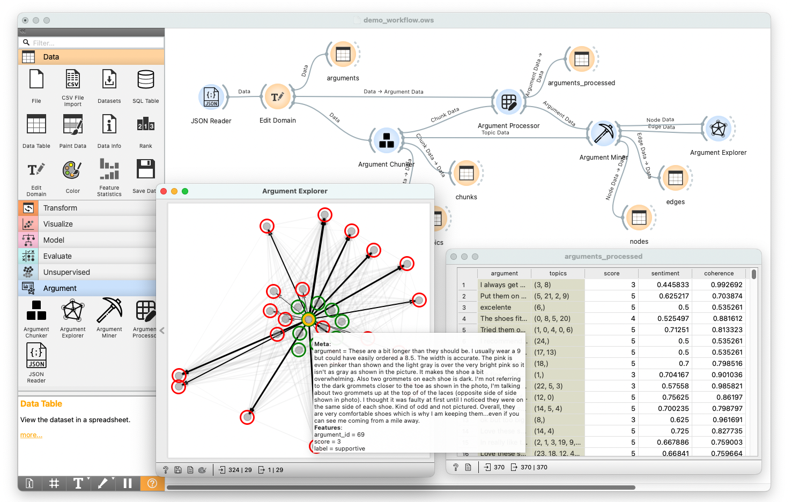

# Orange3 Argument Mining Add-on

[](https://github.com/EyeofBeholder-NLeSC/orange3-argument/actions/workflows/build.yml)
[](https://sonarcloud.io/summary/new_code?id=EyeofBeholder-NLeSC_orange3-argument)
[](https://sonarcloud.io/summary/new_code?id=EyeofBeholder-NLeSC_orange3-argument)
[](https://orange3-argument.readthedocs.io/en/latest/)
[](https://github.com/psf/black)
[](./LICENSE)
[](./setup.cfg)



This is a Python package that implement a selection of argument mining techniques for argument classification and attacking relationship visualization. Modules are wrapped up with GUIs implemented on [Orange3](https://orangedatamining.com/), a powerful open-source platform to perform data analysis and visualization.  


## Installation

To install, first navigate to the project folder in terminal. We recommand you to create a virtual environment and install everything there. You can choose whatever tool you prefer to do so.

After activating your newly created virtual environment, you can install the add-on, together with Orange3 and all the other dependencies by running

```
pip install -e .
```

This will register the add-on but keep the code in the development directory (will not copy it to Python's site-packages directory).


## Usage

After the installation, the widget from this add-on is registered with Orange. To run Orange from the terminal,
use

```
python -m Orange.canvas
```

This will also allow you to see what's going on in the background from terminal.

A demo workflow together with a sample dataset are provided alongside this codebase.

After loading the workflow, you should be able to see the Orange interface like this:


## Credits

This package was created with the [Orange3 Example Add-on](https://github.com/biolab/orange3-example-addon).