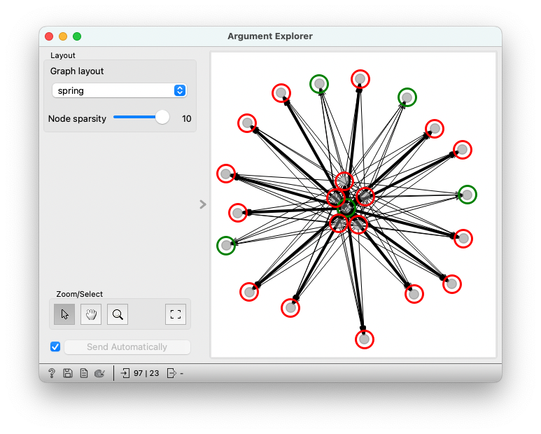

# Argument Explorer

Network visualization of argument attacking relationships.

## Signals

**Inputs**

- `Edge Data`: Edga information table (source, target, widget, etc.)
- `Node Data`: Node information table (index, label, etc.)

**Outputs**

- `Selected Data`: Node information table of selected data

## Description

**Argument Explorer** accepts edge and node information as input and generates network visualization of argument attacking relationship. Functions like zooming, panning, selecting are provided for navigation. Various layouts can be applied for answering different research questions.

## Control

- `Graph layout`: layout used for positing nodes and edges in the network, supported options include `spring`, `multipartite`, `kamada kawai`, and `spectral`.
- `Node sparsity`: spatial closeness of nodes, in range of [1, 10]

## Example

This example shows visualization of a small attacking network with 23 nodes and 97 edges. We have used data extracted from a subset of the [Amazon product review](https://datasetsearch.research.google.com/search?src=2&query=Amazon%20Product%20Reviews&docid=L2cvMTFycDMyZGZydw%3D%3D) dataset. We have decided to use the spring layout with node sparsity to be 10. In the visualization, nodes are colored by labels by default, and thickness of edges represents edge weights. 

