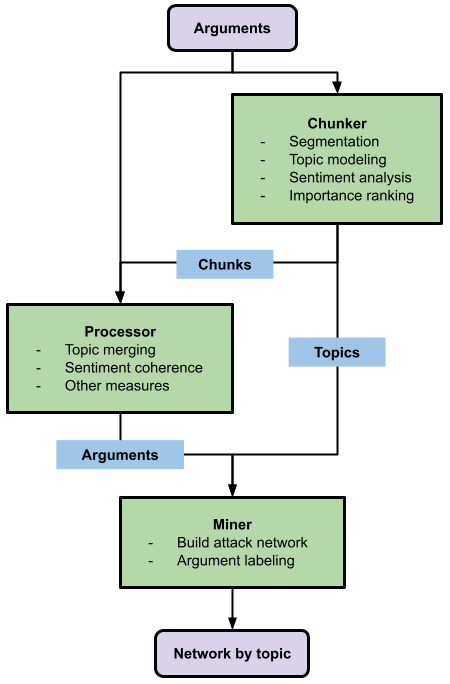

Introduction
============

This work is designed with a clear mission: to empower researchers in building their own argument mining workflows effortlessly. Leveraging the capabilities of state-of-the-art, pre-trained language models for natural language processing, this tool facilitates the process of processing, analyzing, and understanding arguments from text data.

At its core, this work is committed to transparency and interpretability throughout the analysis process. We believe that clarity and comprehensibility are paramount when working with complex language data. As such, the tool not only automates the task but also ensures that the results are easily interpretable, allowing researchers to gain valuable insights from their data.

Moreover, we have implemented an intuitive, visual programming module that brings the power of argument mining to researchers with limited programming expertise. This feature enables individuals from diverse backgrounds to harness the potential of argument analysis, making it accessible to a broader range of researchers and practitioners.

The package contains three components that can be used to build the workflow:

* Chunker: Split arguments into smaller chunks, learn topics of chunks through topic modeling, measure sentiment and important of chunks within arguments.

* Processor: Merge chunks and meta back to arguments, compute coherence and other potential measurements of arguments.

* Miner: Build attack network of arguments, label supportive and defeated arguments based on the network structure.