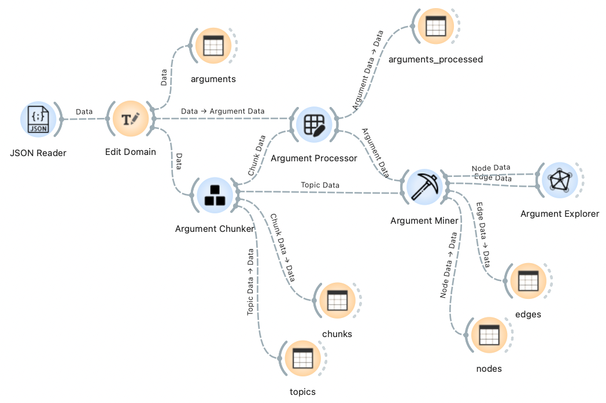
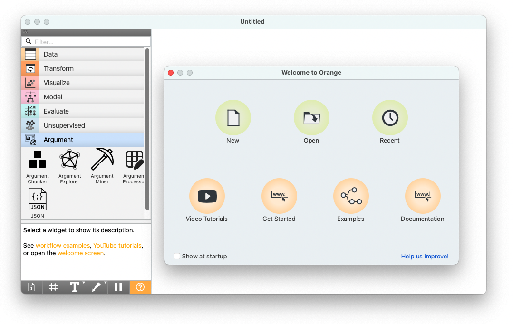

Use as Widgets on Orange3
=========================

We have developed a series of widgets on Orange3, bundling all the essential functionalities for this task. These widgets not only facilitate the analysis but also offer additional visual exploration tools for a more intuitive understanding of the results and insights discovery. Researchers can also benefit from the flexibility of Orange3's built-in functionalities and components to tailor workflows to their specific research needs. 

How to use this package on Orange3
----------------------------------

It's highly recommended that you first read the `documents <https://orangedatamining.com/docs/>`_ of Orange3, especially the visual programming session, to understand the basics of building scientific workflows with Orange3. Especially, Orange3 provides a substantial number of `built-in widgets <https://orangedatamining.com/widget-catalog/>`_, which are quite useful. 

For demonstration purpose, an example workflow is provided in the `GitHub repository <https://github.com/EyeofBeholder-NLeSC/orange3-argument/tree/doc/examples>`_ to showcase how to utilize this library effectively within Orange3.

To run the workflow on your own computer, you need to first install our package, which includes all the dependencies. Then, to start Orange3 GUIs, run the following command in your terminal:

.. code-block:: console

        python -m Orange.canvas

Executing this command will launch the Orange3 GUI, known as the 'canvas.' If your setup is correct, you should observe the following interface, where the 'Argument' add-on is visible on the left panel of widgets. After reaching this point, you can proceed by opening the workflow file and running it sequentially from left to right. Start by double-clicking on the 'JSON Reader' widget to load the example dataset file located in the same folder as the workflow file.

.. note::
    Loading pre-trained language models and performing topic modeling with the `Argument Chunker` widget may take some time, which might make the program appear unresponsive. Kindly exercise patience and wait for a moment.

User manual of the widgets
--------------------------

.. toctree::
    :maxdepth: 1

    widgets/OWArgJSONReader
    widgets/OWArgChunker
    widgets/OWArgProcessor
    widgets/OWArgMiner
    widgets/OWArgExplorer