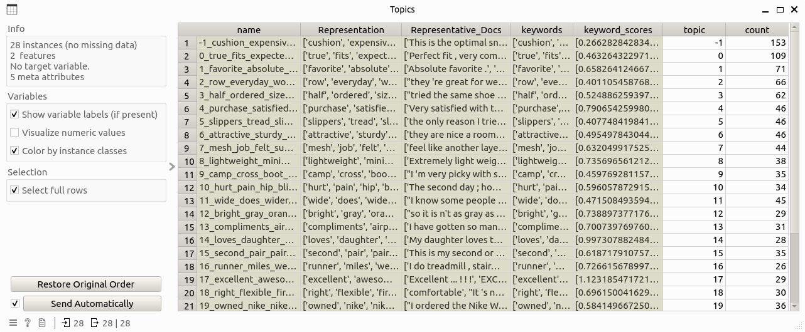

Argument Chunker
==================

Segment text-based arguments, enable users to explore the thematic structure of the arguments and their underlying topics.

Signals
-------

**Inputs**

* ``Data``: Data table that contains the argument-level information. This table must contain two columns: *argument* for argument text and *score* that is the corresponding overview score.

**Outputs**:

* ``Chunk Data``: Data table that contains information about argument chunks, including columns: chunk, argument_id, topic, rank, and polarity_score.

* ``Topic Data``: Data table that contains information about topics of chunks, including columns: name, Representation, Representative_Docs, keywords, keyword_scores, topic, and count.

Description
-----------

**Argument Chunker** implements the following functions:

* Chunking: Argument texts are first splitted into sentences, which will then be further parsed into chunks. Dependency parsing is chosen as the default parsing method here. A chunk corpus is generated as the result of this step, including chunk text and the corresponding argument id.

* Topic modeling: Topic modeling is performed on the chunk corpus to learn the themes there. This process is implemented based on a BERT-based topic modeling approach in Python named `BERTopic <https://maartengr.github.io/BERTopic/index.html>`_. To summarize this step in brief: chunks are first embedded as high-dimensional vectors through a pre-selected sentence-transformer model; then a dimensionality reduction algorithm is applied to reduce the dimension of the vectors for efficient computation; afterwards, chunks are clustered based on the corresponding vectors, with control of clustering outliers; and finally topics are generated on top of the clustering results.

* Sentiment analysis: Each chunk will be calculated the sentiment (polarity) scores, while the definition of sentiment polarity and an example can be found `here <https://textblob.readthedocs.io/en/dev/quickstart.html?highlight=sentiment%20score#sentiment-analysis>`_.

* Chunk ranking: Chunks are ranked on the argument level, this means each chunk will be given a score of importance within the argument it belongs. This ranking is calculated through PageRank of chunks on their similarity network.

Control
-------

(None)

Example
-------

The following workflow shows how the argument chunker widget works:

where the input `Arguments`` table looks like this:

.. image:: ./images/df_arguments.png

Double-clicking on the widget will show the following subinterface:

After clicking the `chunk`` button and wait for a while, and input table will be processed and two output tables are generated like this.

.. image:: ./images/df_chunks.png

