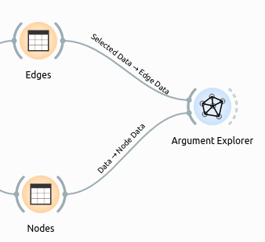
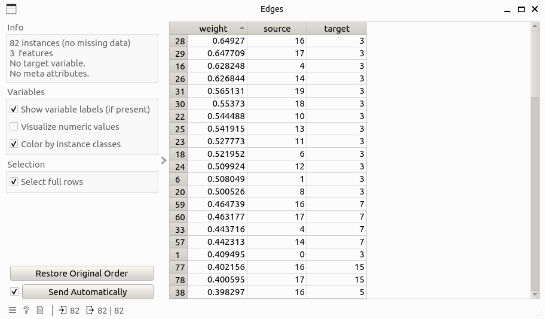
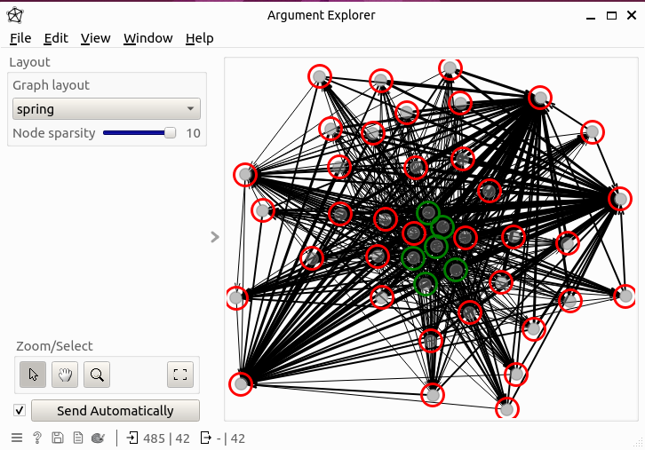

Argument Explorer
=================

Network visualization of argument attacking relationships.

**Inputs**

- `Edge Data`: Data table that contains edge information of the argument attacking network, including columns: source, target, weight.
- `Node Data`: Data table that contains node information of the argument attacking network.

**Outputs**

- `Selected Data`: Data table that contains information of the selected nodes.

Description
-----------

**Argument Explorer** has the following function:

- Network visualization: The argument attacking network is visualized with node coler representing their labels (green for supportive and red for defeated) and edge width for showing weights.
- Node selection: This widget allows to select node(s) and this will update the output table that contains the information of selected nodes. Also, when a node is selected, all the edges relevant to that node will be highlighed by hiding the unrelevant edges.
- Layouting: A set of network layout can be chosen, that include **spring**, **multipartite**, **kamada kawai**, and **spectral**. 
- Navigation: This widget supports a series of navigating functions for better observing the network, that include **zooming**, **panning**, and **centralizing**. Also, by hovering over a node, the relevant meta information of that node will be shown in the popping-up tooltips.

Control
-----------

- `Graph layout`: Layout used for positing nodes and edges in the network.
- `Node sparsity`: Spatial closeness of nodes, in range of [1, 10]
- `Zoom/Select`: Navigation tools for better observing the network.
- `Send Automatically`: if the checkbox is enabled, the information of selected nodes will be automatically sent to the output data. 

Example
-----------

Here is an example workflow that shows how the widget works:

where the input **Edges** and **Nodes** table look like this:

The result network can be observed directly from the widget subinterface:

