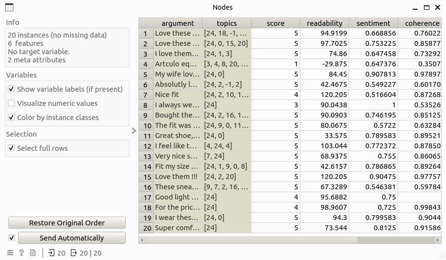

Argument Explorer
=================


Network visualization of argument attacking relationships.

**Inputs**

* ```Edge Data``: Data table that contains edge information of the argument attacking network, including columns: source, target, weight.

* ``Node Data``: Data table that contains node information of the argument attacking network.

**Outputs**

* ``Selected Data``: Data table that contains information of the selected nodes.

Description
-----------

**Argument Explorer** has the following function:

* Network visualization: The argument attacking network is visualized with node coler representing their labels (green for supportive and red for defeated) and edge width for showing weights.

* Node selection: This widget allows to select node(s) and this will update the output table that contains the information of selected nodes. Also, when a node is selected, all the edges relevant to that node will be highlighed by hiding the unrelevant edges.

* Layouting: A set of network layout can be chosen, that include `spring`, `multipartite`, `kamada kawai`, and `spectral`. 

* Navigation: This widget supports a series of navigating functions for better observing the network, that include `zooming`, `panning`, and `centralizing`. Also, by hovering over a node, the relevant meta information of that node will be shown in the popping-up tooltips.

Control
-------

* ``Graph layout``: Layout used for positing nodes and edges in the network.

* ``Node sparsity``: Spatial closeness of nodes, in range of [1, 10]

* ``Zoom/Select``: Navigation tools for better observing the network.

* ``Send Automatically``: if the checkbox is enabled, the information of selected nodes will be automatically sent to the output data. 

Example
-------

Here is an example workflow that shows how the widget works:

.. image:: ./images/wf_explorer.png

where the input **Edges** and **Nodes** table look like this:

.. image:: ./images/df_edges.png



The result network can be observed directly from the widget subinterface:


