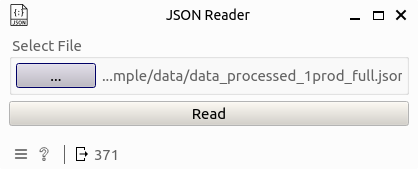

JSON File Reader
================

Read a local JSON file and output its data as a table.

Signals
-------

**Inputs**

* (None)

**Outputs**:

* ``Data``: Output data table

Description
-----------

**JSON File Reader** provides a user interface for selecting and reading a local JSON file. It processes the JSON content, converts it to a table, and outputs the resulting data as a Table type output, which can be used in an Orange workflow for further analysis and visualization. 

Example
-------

Here is an example workflow of using the JSON file reader widget to read a json file.

Double-clicking the widget opens a sub-interface where users can use the ``...`` button to select an input file using the system file browser.

Clicking the ``Read`` button will get the following table as output

