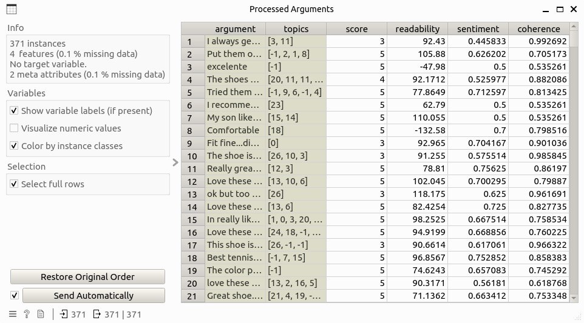
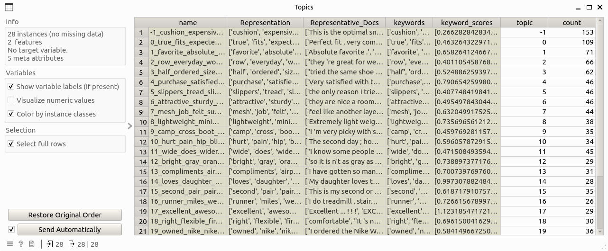
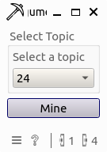
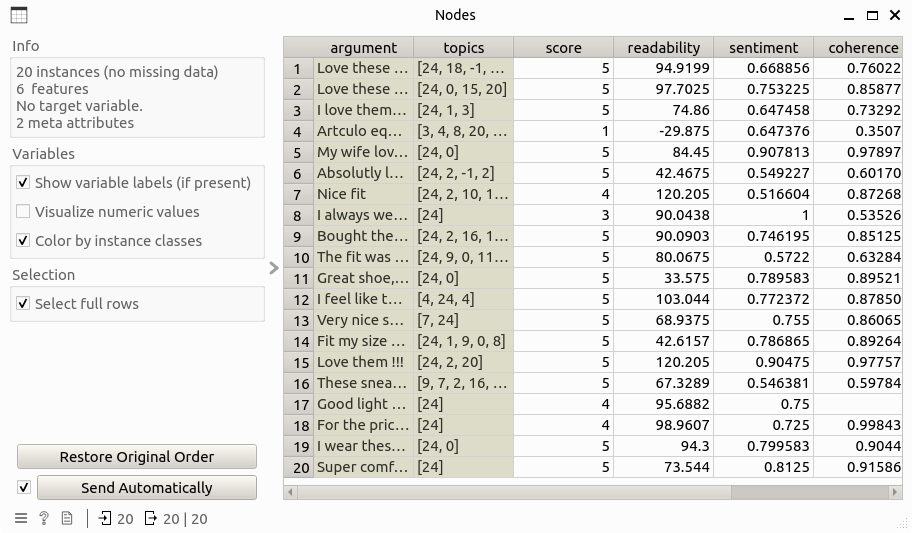
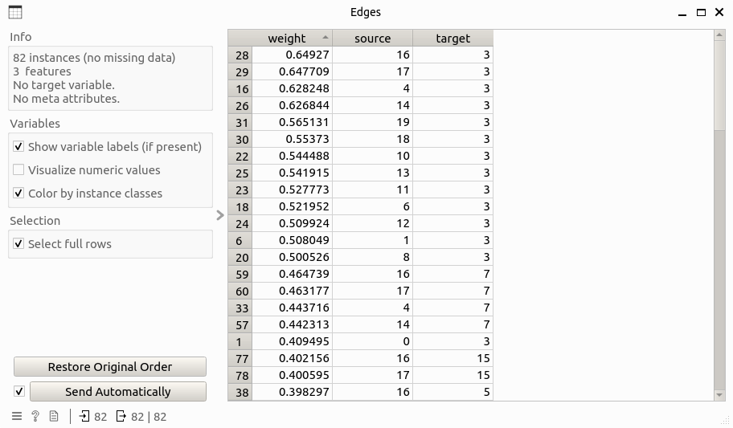

Argument Miner
================

Generate attacking relationship information of arguments from argument corpus.

## Signals

**Inputs**
- `Argument Data`: Data table that contains additional information of arguments to the input data table, including columns: argument, score, topics, readability, sentiment, and coherence.

**Outputs**:

- `Edge Data`: Data table that contains edge information of the argument attacking network, including columns: source, target, weight.
- `Node Data`: Data table that contains node information of the argument attacking network, including one additional column than the input argument data table that is label.

## Description

**Argument Miner** has the following functions:

- Attacking network mining: Based on the input table, an argument attacking network is learned for a given topic, where nodes are arguments that cover the given topic, and edges represent a kind of disagreeing relation between arguments. Weights of edges are computed as the coherence gap of the corresponding two nodes, while direction is determined as from high to low coherent node.
- Node labeling: Based on the learned structure of the attacking network, nodes (arguments) are classified and labeled as either **supportive** or **defeated**, which can be simply understood as reliable or non-reliable. There are three roles of labeling the nodes:
    - If a node is not being attacked by any other nodes, this node is labeled as supportive.
    - If all attackers of a node are being attacked by some other nodes, this node is labeled as supportive.
    - If a node is not supportive, it is labeled as defeated.

## Control

- `Select topic`: a combo box that allows user to choose a topic to generate the attacking network. 

## Example

Here is an example workflow that shows how the argument miner widget works:

where the input **Processed Arguments** and **Topics** tables are as follows:

Double-clicking the widget opens the subinterface of the widget like this:

By selecting the target topic (24 in this example) and clicking the **mine** button, the result **Nodes** and **Edges** tables are generated as follows:

