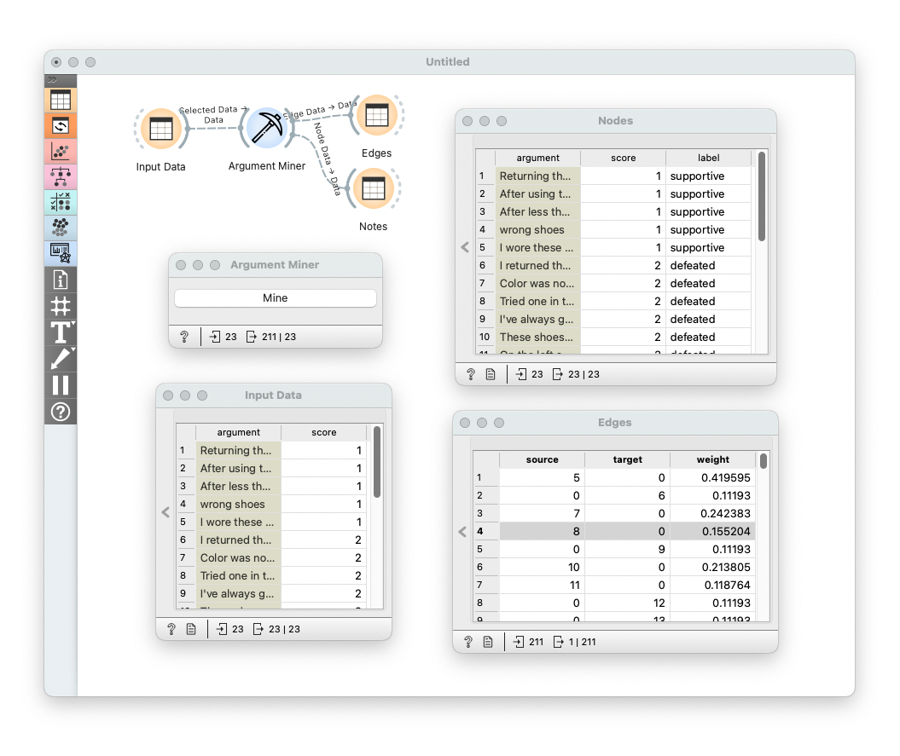

# JSON File Reader

Generate attacking relationship information of arguments from argument corpus.

## Signals

**Inputs**

- `Data`: Argument corpus data table that must contain the following two columns
    - `argument`: argument text
    - `score`: a numerical grade to an argument (e.g. star grade of Amazon products)

**Outputs**:

- `Edge Data`: Edge information table that contains the following three columns
    - `source`: index of the starting node of an edge
    - `target`: index of the ending node of an edge
    - `weight`: edge weight.
- `Node Data`: Node information table that extends the input data table with one extra column
    - `lable`: role label of an argument in attacking network, either "supportive" or "defeated"

## Description

**Argument Miner** reads a table of arugment corpus as input, and output the edge and node tables that forms the attacking network of arguments. What this widget does can be summarized as follows:

- Group arguments by topics
- Compute reliability of each argument based on its readability, contribution to the topic it belongs to, etc.
- Compute attacks between arguments based on the following rules:
    - Attacks exist only within topic groups.
    - Attacks exist between arguments with different scores.
    - More reliable arguments attack less reliable ones.
    - Weight of an attack is the reliability gap of the two relevant arguments.
- Compute labels of arguments based on the following rules:
    - A "supportive" argument is one whose attackers are all under attacked.
    - Arguments that are not "supportive" are labeled as "defeated".

## Control

For now, no extra control is provided in this widget, but only a button to trigger the mining process. However, we would like to give more flexibilities to the users to customize the miner as desired. This means more controls are planed and will be added in future releases.

## Example

This example shows a demo workflow and the output, generated from a [sample dataset](https://raw.githubusercontent.com/EyeofBeholder-NLeSC/orange3-argument/main/example/data/data_processed_1prod_sample.json) that is also provided in the GitHub repository of this widget. 

