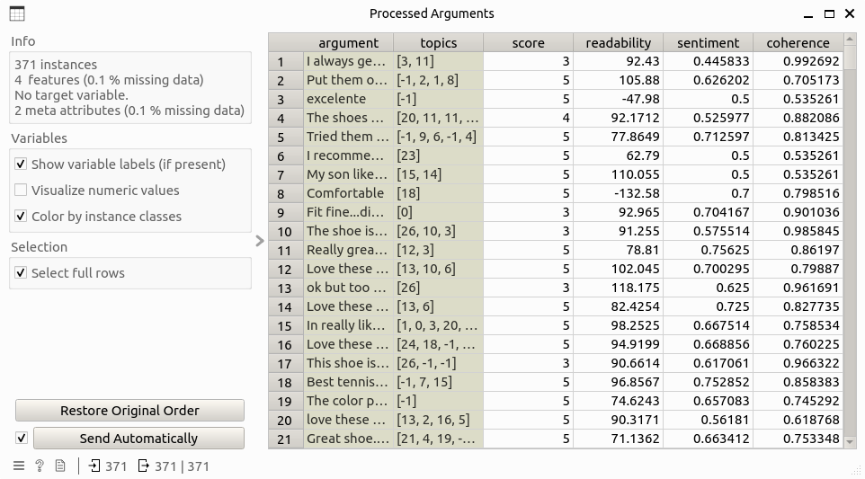

Argument Processor
==================

Calculate argument-level metrics and measures.

Signals
-------

**Inputs**

* ``Argument Data``: Data table that contains the argument-level information. This table must contain two columns: *argument* for argument text and *score* that is the corresponding overview score.

* ``Chunk Data``: Data table that contains information about argument chunks, including columns: chunk, argument_id, topic, rank, and polarity_score.

**Outputs**:

* ``Argument Data``: Data table that contains additional information of arguments to the input data table, including columns: argument, score, topics, readability, sentiment, and coherence.

Description
-----------

**Argument Processor** implements the following functions:

* Topic merging: For each argument, its topic is defined as the combination of the topics of chunks that belongs to this one.

* Argument readability computing: The Flesh-Kincaid reading score is computed for each arugment, check this `link <https://spacy.io/universe/project/spacy_readability>`_ for more information.

* Argument Coherence computing: In this step, the coherence between the sentiment and overall score of arguments are calculated, where the sentiment score of argument is calculated as the sum of sentiment scores of corresponding chunks, weighted by chunk ranks.

Control
-------

(None)

Example
-------

Here is an example workflow that shows how the argument processor widget works:

where the input `Arguments` and `Chunks` table look like this:

Double-clicking the widget opens the subinterface like this:

By clicking on the ``Process`` button and wait for a while, the result data table will be computed like this:

